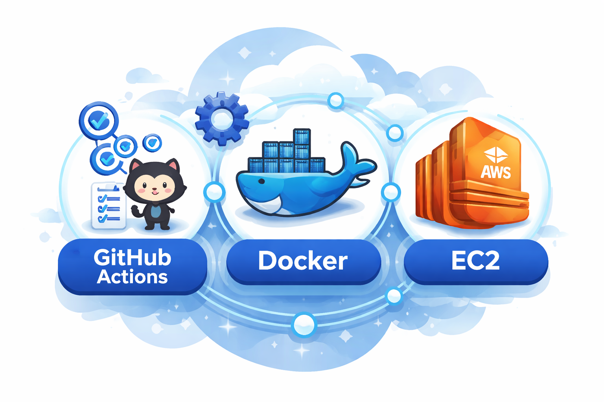
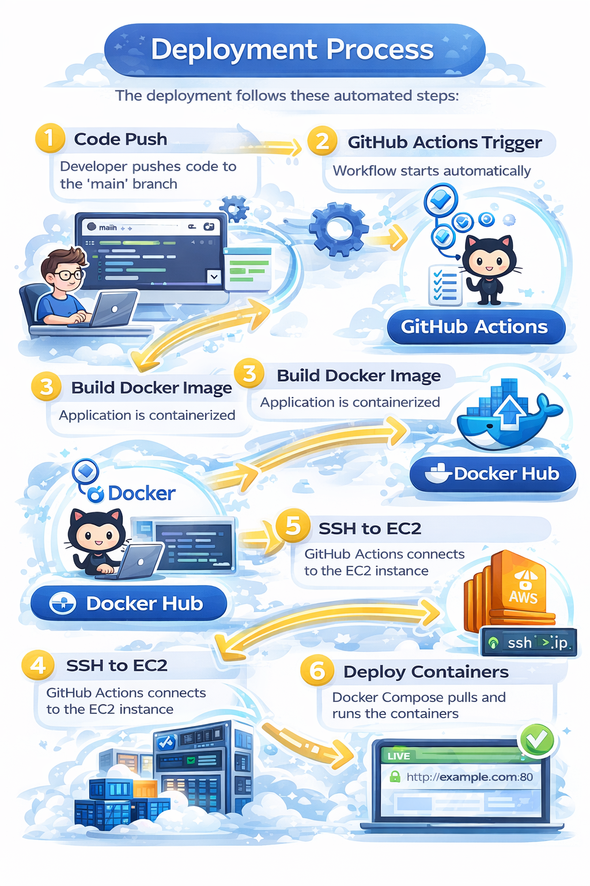

# FastAPI CRUD Application Deployment with GitHub Actions, Docker, and AWS EC2

This project demonstrates a complete CI/CD pipeline for deploying a FastAPI CRUD application with PostgreSQL database using GitHub Actions, Docker, and AWS EC2.

## Table of Contents

- [Project Overview](#project-overview)
- [Architecture](#architecture)
- [Prerequisites](#prerequisites)
- [Project Structure](#project-structure)
- [Setup Instructions](#setup-instructions)
- [Deployment Process](#deployment-process)
- [Configuration Files](#configuration-files)
- [Troubleshooting](#troubleshooting)

## Project Overview

This project implements a FastAPI-based CRUD web application with:
- PostgreSQL database backend
- Docker containerization
- Automated CI/CD pipeline using GitHub Actions
- Deployment to AWS EC2 instance
- Docker Compose for multi-container orchestration

## Architecture

```
GitHub Repository → GitHub Actions → Docker Hub → AWS EC2 → Running Application
```

**Components:**
- **FastAPI Application**: Python web application with CRUD operations
- **PostgreSQL Database**: Persistent data storage
- **Docker**: Containerization platform
- **Docker Hub**: Container registry
- **GitHub Actions**: CI/CD automation
- **AWS EC2**: Cloud hosting infrastructure

## Prerequisites

Before starting, ensure you have:

1. **AWS Account** with EC2 access
2. **GitHub Account**
3. **Docker Hub Account**
4. **Terraform** installed (for infrastructure setup)
5. **SSH Key Pair** for EC2 access
6. Basic knowledge of Docker, Git, and Linux commands

## Project Structure

```
project-root/
├── .env/
│   └── dev_env                 # Environment variables
├── .github/
│   └── workflows/
│       └── deploy.yaml         # GitHub Actions workflow
├── app/
│   ├── static/
│   │   └── style.css           # CSS styles
│   ├── templates/
│   │   ├── base.html           # Base template
│   │   ├── create.html         # Create page
│   │   ├── edit.html           # Edit page
│   │   └── index.html          # Home page
│   ├── crud.py                 # CRUD operations
│   ├── database.py             # Database configuration
│   ├── main.py                 # FastAPI application
│   ├── models.py               # SQLAlchemy models
│   └── schemas.py              # Pydantic schemas
├── .gitignore
├── docker-compose.yaml         # Docker Compose configuration
├── Dockerfile                  # Application container definition
└── requirements.txt            # Python dependencies
```

## Setup Instructions

### Step 1: Create EC2 Instance with Terraform

Create a `user_data.sh` script to bootstrap the EC2 instance:

```bash
#!/bin/bash
set -euxo pipefail
export DEBIAN_FRONTEND=noninteractive

# Update system
apt-get update -y

# Install required packages
apt-get install -y \
  ca-certificates \
  curl \
  gnupg \
  lsb-release \
  software-properties-common

# Create keyring directory
mkdir -p /etc/apt/keyrings

# Add Docker GPG key
curl -fsSL https://download.docker.com/linux/ubuntu/gpg \
  | gpg --dearmor -o /etc/apt/keyrings/docker.gpg

# Add Docker repo
echo \
  "deb [arch=$(dpkg --print-architecture) signed-by=/etc/apt/keyrings/docker.gpg] \
  https://download.docker.com/linux/ubuntu \
  $(lsb_release -cs) stable" \
  | tee /etc/apt/sources.list.d/docker.list > /dev/null

# Install Docker
apt-get update -y
apt-get install -y docker-ce docker-ce-cli containerd.io

# Enable Docker
systemctl enable docker
systemctl start docker

# Add ubuntu user to docker group
usermod -aG docker ubuntu

# Check Docker Version
docker --version
```

This script:
- Updates the system packages
- Installs Docker and its dependencies
- Enables and starts the Docker service
- Adds the `ubuntu` user to the docker group for non-root access

### Step 2: Configure Environment Variables

Create `.env/dev_env` file with the following content:

```env
# Application Image
APP_IMAGE=pujan240/crud_app:latest

# Database Image
DATABASE_IMAGE=postgres:15

# Postgres environment variables
POSTGRES_USER=admin
POSTGRES_PASSWORD=admin123
POSTGRES_DB=crud_db
```

### Step 3: Manual EC2 Setup (One-Time Only)

After the EC2 instance is created, perform these one-time setup steps:

```bash
# SSH into your EC2 instance
ssh -i your-key.pem ubuntu@<EC2_PUBLIC_IP>

# Create .env directory
mkdir -p ~/.env

# Exit from EC2
exit

# Copy environment file from local to EC2
scp -i your-key.pem .env/dev_env ubuntu@<EC2_PUBLIC_IP>:~/.env/
```

### Step 4: Configure GitHub Secrets

Navigate to your GitHub repository: **Settings → Secrets and variables → Actions**

**Add Repository Secrets:**

1. **DOCKERHUB_PASSWORD**
   - Value: Your Docker Hub Personal Access Token (PAT)
   - Generate PAT from Docker Hub: Account Settings → Security → New Access Token

2. **SSH_KEY64**
   - Value: Base64-encoded SSH private key
   - Encode your key: `base64 < your-key.pem`
   - Copy the entire output

   Secrets


**Add Repository Variables:**

1. **DOCKER_USER**: Your Docker Hub username
2. **DOCKER_REPO**: Your Docker Hub repository name (e.g., `crud_app`)
3. **SERVER_IP**: Your EC2 instance public IP address
4. **SERVER_USER**: EC2 user (typically `ubuntu`)

variables


### Step 5: Push to GitHub

```bash
# Initialize git repository (if not already done)
git init

# Add all files
git add .

# Commit changes
git commit -m "Initial commit: FastAPI CRUD app with CI/CD"

# Add remote repository
git remote add origin https://github.com/yourusername/your-repo.git

# Push to main branch
git push -u origin main
```

This will trigger the GitHub Actions workflow automatically.

## Deployment Process

The deployment follows these automated steps:

1. **Code Push**: Developer pushes code to the `main` branch
2. **GitHub Actions Trigger**: Workflow starts automatically
3. **Build Docker Image**: Application is containerized
4. **Push to Docker Hub**: Image is uploaded to the registry
5. **SSH to EC2**: GitHub Actions connects to the EC2 instance
6. **Deploy Containers**: Docker Compose pulls and runs the containers
7. **Application Live**: App is accessible on port 80



### Monitoring Deployment

- Navigate to your GitHub repository
- Click on the **Actions** tab
- View the workflow run and logs
- Each step shows success/failure status

### Dashboard


### Summary


### WebPage


## Configuration Files

### Dockerfile

```dockerfile
FROM python:3.11-slim
WORKDIR /app
COPY requirements.txt .
RUN pip install --no-cache-dir -r requirements.txt
COPY . .
CMD ["uvicorn", "app.main:app", "--host", "0.0.0.0", "--port", "8000"]
```

### docker-compose.yaml

```yaml
version: "3.9"

services:
  db:
    image: ${DATABASE_IMAGE}
    env_file: 
      - ./.env/dev_env
    container_name: fastapi-db
    environment:
      POSTGRES_USER: ${POSTGRES_USER}
      POSTGRES_PASSWORD: ${POSTGRES_PASSWORD}
      POSTGRES_DB: ${POSTGRES_DB}
    volumes:
      - postgres_data:/var/lib/postgresql/data

  app:
    image: ${APP_IMAGE}
    env_file: 
      - ./.env/dev_env
    container_name: fastapi-app
    ports:
      - "80:8000"
    depends_on:
      - db
    environment:
      POSTGRES_USER: ${POSTGRES_USER}
      POSTGRES_PASSWORD: ${POSTGRES_PASSWORD}
      POSTGRES_DB: ${POSTGRES_DB}

volumes:
  postgres_data:
```

### database.py

```python
import os
from sqlalchemy import create_engine
from sqlalchemy.orm import sessionmaker, declarative_base

POSTGRES_USER = os.getenv("POSTGRES_USER")
POSTGRES_PASSWORD = os.getenv("POSTGRES_PASSWORD")
POSTGRES_DB = os.getenv("POSTGRES_DB")
POSTGRES_HOST = os.getenv("POSTGRES_HOST", "db")

DATABASE_URL = (
    f"postgresql://{POSTGRES_USER}:{POSTGRES_PASSWORD}"
    f"@{POSTGRES_HOST}/{POSTGRES_DB}"
)

engine = create_engine(DATABASE_URL)

SessionLocal = sessionmaker(
    autocommit=False,
    autoflush=False,
    bind=engine
)

Base = declarative_base()
```

### GitHub Actions Workflow (deploy.yaml)

```yaml
name: "Build and run Docker in EC2"

on:
  push:
    branches:
      - main

jobs:
  deploymycode:
    name: "Deploy my code in Docker container in EC2"
    runs-on: ubuntu-latest
    env:
      SERVER_IP: ${{ vars.SERVER_IP }}
      SERVER_USER: ${{ vars.SERVER_USER }}
      DOCKER_HUB_USER: ${{ vars.DOCKER_USER }}
      DOCKER_HUB_REPO: ${{ vars.DOCKER_REPO }}
    
    steps:
      - name: "Checkout Code"
        uses: actions/checkout@v4
        with:
          fetch-depth: 0
      
      - name: "Setup TAG"
        run: |
          echo "TAG=latest" >> $GITHUB_ENV
      
      - name: "Setup Docker Buildx"
        uses: docker/setup-buildx-action@v3

      - name: "Login to DockerHub"
        run: |
          echo "${{ secrets.DOCKERHUB_PASSWORD }}" | docker login -u $DOCKER_HUB_USER --password-stdin
      
      - name: "Build Docker Image"
        run: |
          docker build -t "$DOCKER_HUB_USER/$DOCKER_HUB_REPO:$TAG" .
      
      - name: "Push Docker Image"
        run: |
          docker push "$DOCKER_HUB_USER/$DOCKER_HUB_REPO:$TAG"

      - name: "Setup SSH Connection"
        run: |
          mkdir -p ~/.ssh
          chmod 700 ~/.ssh
          echo -e "Host *\n\tStrictHostKeyChecking no\n" > ~/.ssh/config
          chmod 600 ~/.ssh/config

      - name: Add private key for ssh 
        run: |
          echo "$SSH_KEY64" | base64 -d >> mykey.pem
          chmod 400 mykey.pem 
          touch ~/.ssh/known_hosts
          ssh-keygen -R $SERVER_IP
        env:
          SSH_KEY64: ${{ secrets.SSH_KEY64 }}

      - name: "Copy Docker-Compose file to EC2"
        run: |
          scp -i mykey.pem ./docker-compose.yaml $SERVER_USER@$SERVER_IP:~/
      
      - name: "Make SSH Connection, pull and run Docker Image"
        run: |
          ssh -i mykey.pem $SERVER_USER@$SERVER_IP "
          docker compose --env-file ./.env/dev_env pull
          docker compose --env-file ./.env/dev_env down
          docker compose --env-file ./.env/dev_env up -d
          "
```

## Troubleshooting

### Common Issues and Solutions

**Issue: GitHub Actions fails at Docker login**
- Solution: Verify DOCKERHUB_PASSWORD secret is set correctly
- Ensure you're using a Personal Access Token, not your password

**Issue: SSH connection fails**
- Solution: Check SSH_KEY64 is properly base64 encoded
- Verify SERVER_IP and SERVER_USER variables are correct
- Ensure EC2 security group allows SSH (port 22) from GitHub Actions IPs

**Issue: Application not accessible**
- Solution: Check EC2 security group allows HTTP (port 80)
- Verify containers are running: `docker ps`
- Check container logs: `docker logs fastapi-app`

**Issue: Database connection errors**
- Solution: Verify environment variables in `.env/dev_env`
- Check database container is running: `docker ps`
- Review database logs: `docker logs fastapi-db`

**Issue: Docker Compose file not found on EC2**
- Solution: Ensure the SCP step in GitHub Actions completed successfully
- Manually verify file exists: `ssh -i key.pem ubuntu@<IP> "ls -la ~/"`

### Useful Commands

```bash
# Check running containers on EC2
docker ps

# View application logs
docker logs fastapi-app

# View database logs
docker logs fastapi-db

# Restart containers
docker compose --env-file ./.env/dev_env restart

# Stop all containers
docker compose --env-file ./.env/dev_env down

# View container resource usage
docker stats
```

## Accessing the Application

Once deployed, access your application at:
```
http://<EC2_PUBLIC_IP>
```


